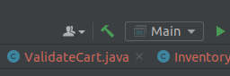
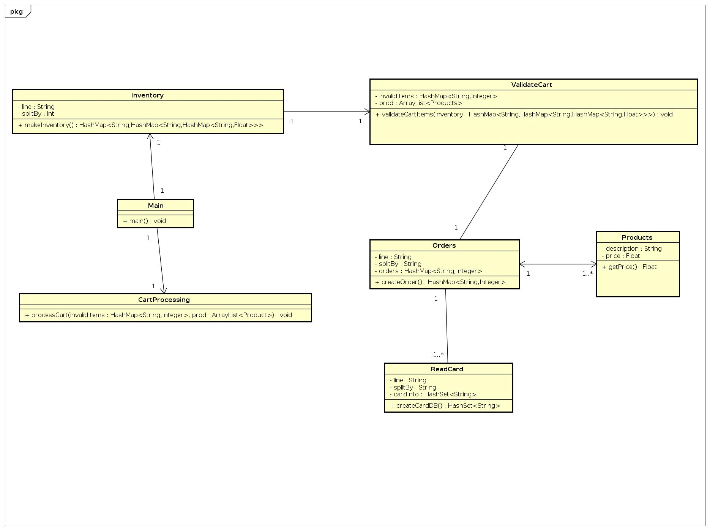
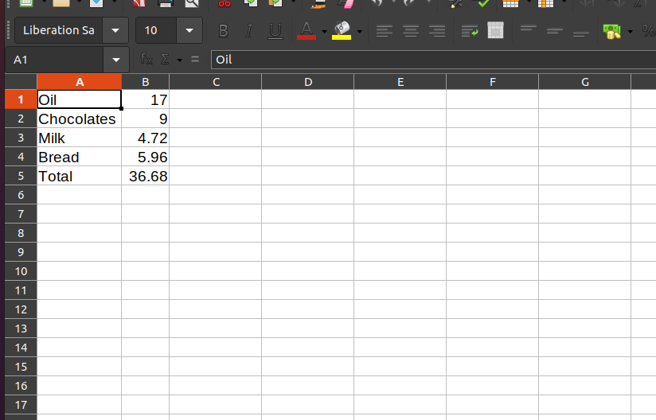
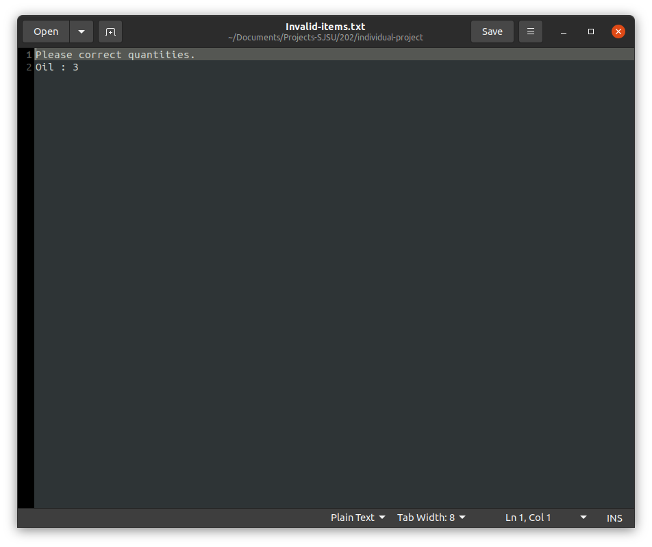
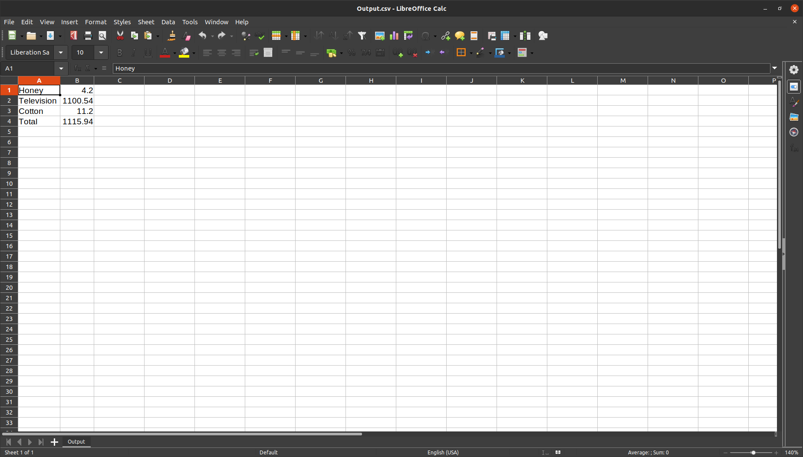

# individual-project-pallav2798

## Instructions to run the project

a) Run In IntelliJ IDEA
1) Clone the repo in a folder.
2) Run the Main class using GUI button RUN on top right corner.
3) To change the "Input csv" files go to Orders.java file ==> line no. 25 and change the input file-name which needs to be used.
4) Keep the Input files and Dataset file on the root level.
5) Output file and the invalid-text file will be generated on the root level.

### RUN THE PROGRAM USING THIS BUTTON

b)  Design Pattern Used in the project is Composite Pattern and Iterator. Because composite will add all individual products in the ArrayList as per need. And Iterator will be used for looping through each items of cart.
 
# UML Diagram

# OUTPUTS

### For Input 1 CSV

### For Input 2 CSV

### For Input 3 CSV

